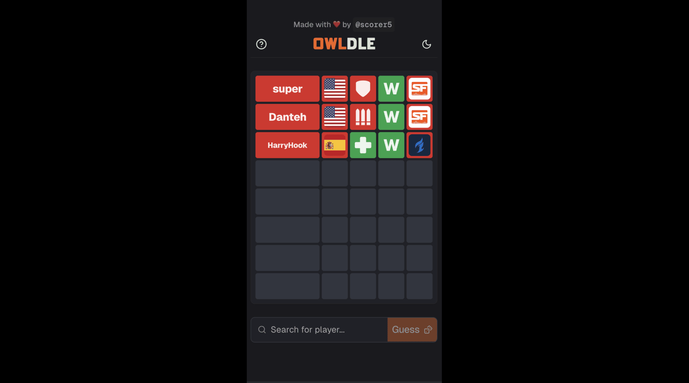

<h3 align="center">
	<br/>
  <br />
    Concert Maps
  <br />

</h2>

<h6 align="center">
  <a href="#showcase">Showcase</a>
  ·
  <a href="#features">Features</a>
  ·
  <a href="#getting-started">Getting Started</a>
  ·
  <a href="#about">About</a>
</h6>

<p align="center">
  
</p>

<p align="center">
	<a href="">
		</a>
	<a href="">
		</a>
	<a href="">
		</a>
	<a href="">
		</a>
  <a href="">
    </a>
  <a href="https://map.bschlegel.com/">
    </a>
  <a href="https://map.bschlegel.com/">
    </a>

</p>

&nbsp;

<p align="center">
TODO: write summary
</p>

## Showcase

|  |  |
| ----------------------------------------- | ----------------------------------------- |
|  |  |

## Getting Started

First, clone the project locally and install dependencies:

```bash
npm install
```

This is a [Next.js](https://nextjs.org) project bootstrapped with [`create-next-app`](https://nextjs.org/docs/app/api-reference/cli/create-next-app).

## Getting Started

First, run the development server:

```bash
npm run dev
# or
yarn dev
# or
pnpm dev
# or
bun dev
```

Open [http://localhost:3000](http://localhost:3000) with your browser to see the result.

You can start editing the page by modifying `app/page.tsx`. The page auto-updates as you edit the file.

This project uses [`next/font`](https://nextjs.org/docs/app/building-your-application/optimizing/fonts) to automatically optimize and load [Geist](https://vercel.com/font), a new font family for Vercel.

## Learn More

To learn more about Next.js, take a look at the following resources:

- [Next.js Documentation](https://nextjs.org/docs) - learn about Next.js features and API.
- [Learn Next.js](https://nextjs.org/learn) - an interactive Next.js tutorial.

You can check out [the Next.js GitHub repository](https://github.com/vercel/next.js) - your feedback and contributions are welcome!

## Deploy on Vercel

The easiest way to deploy your Next.js app is to use the [Vercel Platform](https://vercel.com/new?utm_medium=default-template&filter=next.js&utm_source=create-next-app&utm_campaign=create-next-app-readme) from the creators of Next.js.

Check out our [Next.js deployment documentation](https://nextjs.org/docs/app/building-your-application/deploying) for more details.
