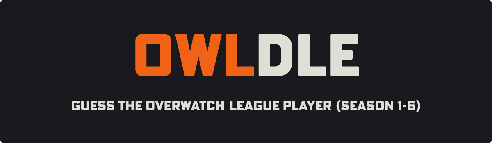
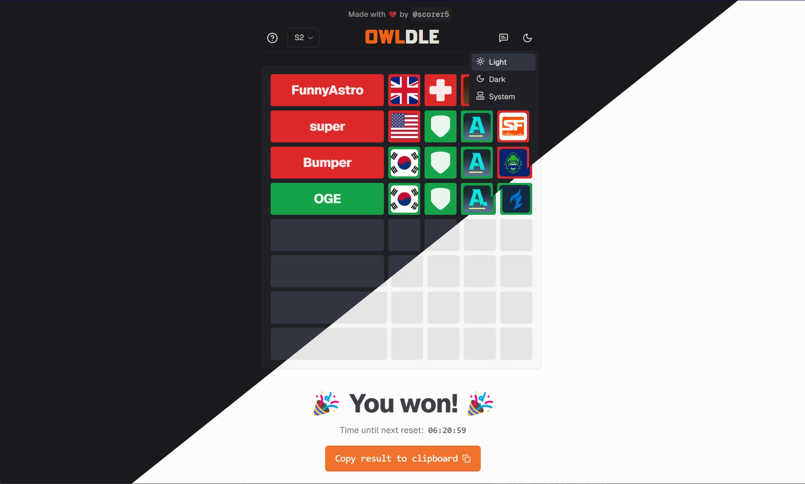

<h3 align="center">
	<br/>
<br/>
  Guess the <a href="https://en.wikipedia.org/wiki/Overwatch_League">Overwatch League</a> (OWL) player using a series of clues (like the players team, role, country and region). Resets every day at midnight.
  <br />

</h3>

<h6 align="center">
  <a href="#showcase">Showcase</a>
  ·
  <a href="#features">Features</a>
  ·
  <a href="#getting-started">Getting Started</a>
  ·
  <a href="#about">About</a>
  .
  <a href="#about">Sponsor me</a>
</h6>

<p align="center">
  
</p>

<p align="center">
	<a href="">
		</a>
	<a href="">
		</a>
	<a href="">
		</a>
	<a href="">
		</a>
  <a href="">
    </a>
  <a href="https://github.com/benschlegel/OWLDLE/blob/main/tests/report.json">
    </a>
  <a href="https://owldle.bschlegel.com/">
    </a>

</p>

## Showcase

|  |  |
| --- | --- |
|  |  |


## Features

This project was built using [`Next.js`](https://nextjs.org/) and [`tailwindcss`](https://tailwindcss.com/). Components are based on [`shadcn/ui`](https://ui.shadcn.com/). Tests were written with [`vitest`](https://vitest.dev/) and [`bun`](https://bun.sh/) is used instead of `npm`.

Major features are:

- 🎨 Consistent and dynamic themes (light + dark mode)
  - All components use theme colors and automatically switch to correct theme
- 📱 Fully responsive
  - Works and looks good on any screen size (desktop + mobile + everything in-between)
- 🛢 Dynamic database scheme
  - Supports dynamic game iteration length (e.g. default to 1 reset per day, but can have more on event day)
  - Supports multiple datasets (e.g. different seasons)
  - saves iteration data to log (iteration number, correct player, time of reset)
- 🕵 Anonymous game result collection (game result + guesses, no information that could identify users)
  - Scheme can be found under `types/database` (`type DbLoggedGame`)
  - saved using `lib/databaseAccess.ts` (`function logGame()`)
- 🎲 Batched pseudo random selection
  - Random backlog of players generated (to keep the game from being stale but also to avoid duplicate players for `backlog.length` iterations)
- 🛠️ Easily configurable
  - The behavior of the game can easily be adjusted by changing values in `game.config.json`
  - Check `lib/config.ts` to find out more info about the config.
- 🦿 Following modern accessiblity recommendations
  - Fully compatible with screen readers
  - Entire website can be navigated/used with keyboard inputs only
- 🕵 Anonymous + EU compliant analytics (using [`Plausible`](https://plausible.io/))
- ⚡ Blazingly fast through server side rendering + vercel edge functions/distributed servers
- 📃 Follows modern SEO standards
  - Automatically generates `robots.txt` (through `robots.ts`)
  - Automatically generates sitemap (through `sitemap.ts`)
  - Uses site metadata (preview image, title, description, etc)
- 🧪 Contains tests for critical functionality
  - Can be configured to automatically write test report/be ran through Github actions
  - Tests for:
    - Main game process + results
    - Checks to ensure all images (even from country flag api) still work
    - Database functions
- ⚠️ Full error handling
  - All invalid input errors are caught client side (with toasts that show what went wrong, works on desktop and mobile) + server side (zod schema validation for all api post endpoints)
  - Rate limit on all api endpoints to increase stability
- and more!


## Getting Started

First, clone the project locally and install dependencies. If you're only working locally, you can also use npm/pnpm/yarn, but this project was built and tested with bun.

```bash
bun install
# or
npm install
```

### env
Before starting the project, make sure you provide the following values to the environment (either directly or by creating a file called `.env.local` in the project root folder):

```bash
MONGO_URI="<your_mongo_uri>"
CRON_SECRET="<your_cron_secret>"
# optional
ADMIN_API_TOKEN="<your_secret>"
```

The only *strictly necessary* entry is `MONGO_URI` (as you won't have a database otherwise), so make sure you provide a valid [`Mongodb`](https://www.mongodb.com/) [connection uri](https://www.mongodb.com/docs/manual/reference/connection-string/).

When trying to use this project in production, you should provide `CRON_SECRET`. This secret gets used in the `api/cron` path, which is responsible for resetting the game periodically (e.g. once per day).

The `ADMIN_API_TOKEN` can be used to secure the (WIP, not yet implemented) admin dashboard and can be skipped for now.

---
After setting up your environment and installing all dependencies, you can start the project like this:

```bash
bun run dev
# or
npm run dev
```

You should now be able to see the website running on `localhost:3000`.

To built the project, you can run
```bash
bun run build
bun run start
# or
npm run build
npm run start
```

## Tests
This project contains tests for the major features under `tests/*.test.ts`. Tests that only run locally are postfixed by `*.local.test.ts` to allow filtering when running tests and ensure local tests always run with maximum performance.

To run tests, run
```bash
bun run test:local # only runs local tests
# or
bun run test # runs all tests
# or (using npm)
npm run test:local # only runs local tests
# or
npm run test # runs all tests
```

I also created a custom test reporter, which writes the following fields to `tests/report.json`:

```json
{
  "numTotalTests": "<total test amount>",
  "numPassedTests": "<passed test amount>",
  "numFailedTests": "<failed test amount>",
  "numPendingTests": "<pending test amount (should always be 0)"
}
```

To execute all tests with the custom reporter, run
```bash
bun run test:write
# or
npm run test:write
```

You should now see the updated report under `tests/report.json`.

## About

Docs coming soon

## Sponsor me
If you like this project, you can support me here

<a href="https://ko-fi.com/bschlegel">
</a>
</a>
